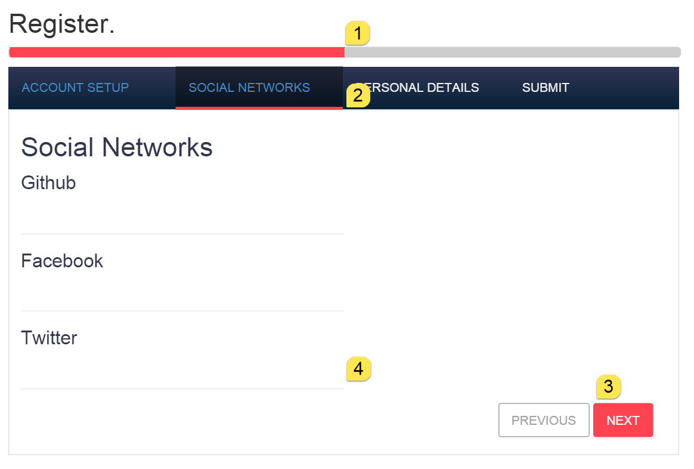
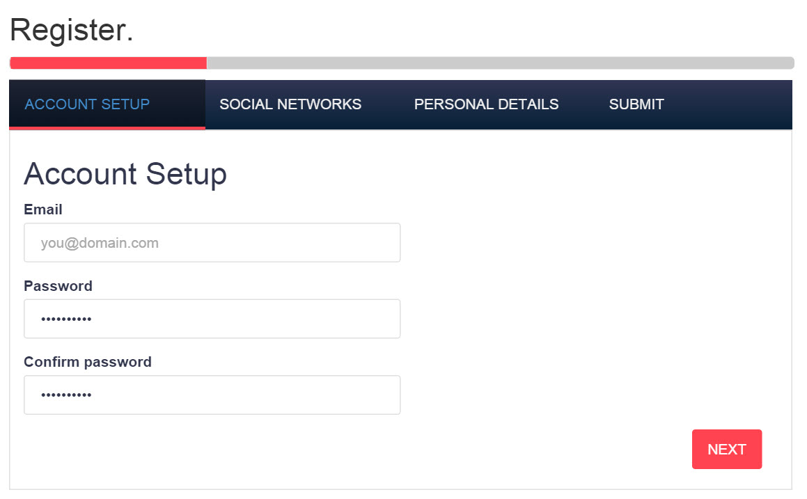
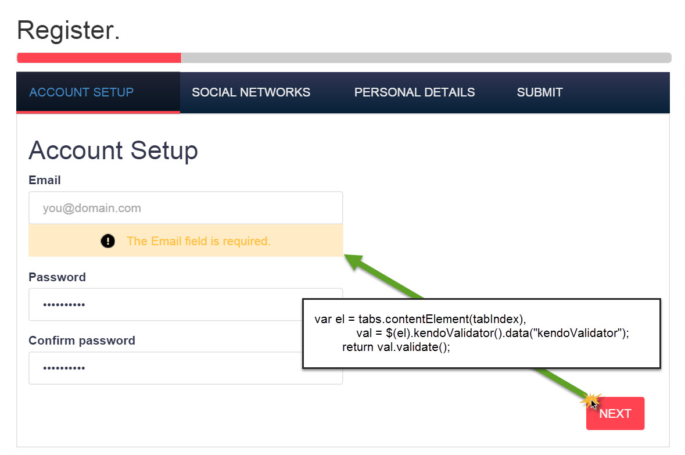
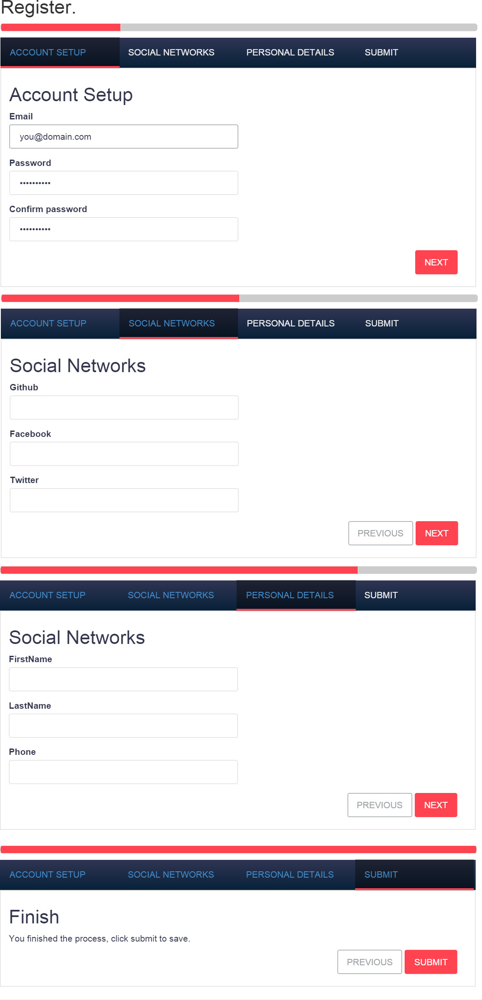

# Get to Steppin with MVC and Kendo UI

For forms with complex procedures, a step-by-step assistant can be helpful. In this article we'll identify some basic scenarios where a step-wise form is beneficial, identify the working pieces and learn to build a step-wise form with Kendo UI and Telerik UI for ASP.NET MVC.

## Wizard Scenarios

Step-wise forms, multi-step forms, or wizards, are a heavy UI, best used for multi-step, infrequently performed task. The decision to use a step-wise form shouldn't be taken lightly, however they are practical for many scenarios which is why they are still found frequently in software today. Prime examples of step-wise forms are seen in e-commerce check out processes and registration forms. And anyone who has used tax software before can admit that entire applications can be made up of many wizards. 

## Anatomy of a step-wise form

The goal of a step-wise form is to guide the user through a process, so it's important to understand what makes up the form and why each piece is needed. 

1. First, the form should always let the user know where they are in the process. A progress bar should be used to indicate which step the user is on and how much of the process remains to be completed.
- The form should be grouped into tasks that are made up of related inputs. By breaking a long process into smaller related tasks, the user can move through the process with less distraction. Steps for the form should be identified at the top to provide context to the group and it's location in the overall process. 
- Buttons may seem trivial, but they serve a very important role in a step-wise form. Buttons are the primary source of navigation for the form and the buttons should be labeled according to their purpose. Previous, Next, and Finish are all excellent examples.
- Finally, each step in the process should be validated independently. Validating at each step helps keep the form concise and ensures that users wont need to return to previous steps to fix an error.

Knowing the makeup of a step-wise form will help understand what is needed to create one. By looking over the pieces familiar UI concepts can be identified, all of which can be found in  Telerik UI for ASP.NET MVC.

## Putting it together

A step-wise form can be accomplished by using a combination of just three Kendo UI widgets, the Progress bar, Tab Strip, and Buttons. The progress bar will track the overall status of the form, the tab strip provides a container for each step and organizes the inputs into groups, and the buttons simple navigation between steps.

First, we'll setup a progress bar using Telerik UI for ASP.NET MVC's Html Helper. Configuration of the progress bar is important because there are various types of progress bars are supported by Kendo UI. In this example we'll be using the `Value` type progress bar. The `Value` progress bar is easier to use in this circumstance because it relies on whole number values rather than percentages. Using whole number values we can simply set the value of the current step to the value of the progress bar, no calculations required.

	@(Html.Kendo().ProgressBar()
                  .Name("profileCompleteness")
                  .Type(ProgressBarType.Value)
                  .ShowStatus(false) // Don't display the value, we'll let the tab strip do that.
                  .Min(0)
                  .Max(4) // Number of steps in the form
                  .Value(1) // Start at step 1
    )

Next we'll use open up a form tag using the BeginForm helper, the form will contain all of the steps so that when it is submitted we can capture all of the data on the server through model binding.

    @using (Html.BeginForm("Register", "Account", FormMethod.Post, new { @class = "form-horizontal", role = "form" })) 
    { ... }

Inside the form initialize a `TabStrip` helper, each `Item` in the tab strip will be a step in the form.

    @(Html.Kendo().TabStrip()
          .Name("tabstrip")
          .Items(tabstrip =>
          { ... })

Partial views can be used with the tab strip to keep them clean. When using strongly typed models, the model can easily be passed to the partial in the content property of the tab strip item.

    @(Html.Kendo().TabStrip()
          .Name("tabstrip")
          .Items(tabstrip =>
          {  
			  tabstrip.Add().Text("Account Setup")
                  .Selected(true) // select the first tab
				   // Set the tab content to a partial view using a strongly typed model 
                  .Content(m => Html.Partial("_RegistrationStep1", m)); 
      		  
			  tabstrip.Add().Text("Social Networks")
                  .Enabled(false) // Disable the tab to prevent skipping ahead.
                  .Content(m => Html.Partial("_RegistrationStep2", m));

	          tabstrip.Add().Text("Personal Details")
                  .Enabled(false)
                  .Content(m => Html.Partial("_RegistrationStep3", m));

              tabstrip.Add().Text("Submit")
              	  .Enabled(false)
                  .Content(m => Html.Partial("_RegistrationStep4", m));
		  })
	)

The partial view can contain as many inputs from the model as needed for that step. Because the model is being passed into the partial strongly typed helpers can be utilized within the partial.  

	// _RegistrationStep1.cshtml
	@{ Layout = null; }
	@model KendoWizardTutorial.Models.RegisterViewModel
	
	<h2>Account Setup</h2>
	

	    

	        @Html.LabelFor(m => m.Email)
	        @(Html.Kendo().TextBoxFor(m => m.Email)
	                .HtmlAttributes(new { placeholder = "you@domain.com", type = "email", @class = "k-textbox required" })
	        )
	    

		...
	

With the tab strip and partial views in place, we can start wiring up the step-by-step behavior. We'll need to write some client-side code to handle how the form handles moving back and forth between steps. We'll also keep track of the current tab index so we can tell which direction the user is moving through the form.

    

Next we'll create event handlers for tab strip's `Show` and `Select` events.

            @(Html.Kendo().TabStrip()
                  .Name("tabstrip")
                  .Items(tabstrip =>
                  { ... })
                .Events(ev =>
                {
                    ev.Select("onSelect");
                    ev.Show("onShow");
                })

            )

The tab strip's `Select` event is also used. The `Select` event will trigger when a tab is being selected by both the UI and the API. In the event handler `onSelect` we'll validate each step before allowing the form to move in a forward direction. Each tab's content element is selected and validated  independently ensuring only fields in the users view can cause validation errors.

        function onSelect(e) {

            var selectedIndex = tabIndexOfElement(e.item),

            isMovingBack = selectedIndex < currentIndex;

            if (isMovingBack || isTabValidAt(currentIndex)) {
                console.log("tab passed validation")
                currentIndex = selectedIndex;
                tabs.enable(getTabAtIndex(currentIndex), true);
            }
            else {
                e.preventDefault();
            }
        }

    function tabIndexOfElement(element) {
        return tabs.element.find(element).index();
    }

    function isTabValidAt(tabIndex) {
        var el = tabs.contentElement(tabIndex),
            val = $(el).kendoValidator().data("kendoValidator");
        return val.validate();
    }

    function getTabAtIndex(index) {
        return tabs.tabGroup.children().eq(index);
    }

The `onShow` event handler syncs the progress bar with the current tab. This will ensure when a tab is shown the progress bar updates with the appropriate value.

        function onShow(e) {
            progress.value(currentIndex + 1);
        }

With the tab behaviors in place, let's add buttons to each step. Each step will have its own "Next" and "Previous" buttons, except for the first and last step. The first step should only have a "Next" button, while the last button should have a "Previous" and "Finish" button.

All of the "Next" buttons will have a common `onNextClick` event handler for the `Click` event. Likewise all "Previous" buttons will have a common `onPreviousClick` event handler for the `Click` event. The "Finish" button will be responsible for posting the form and will be allowed to perform its default behavior.

        function onPreviousClick(e) {
            e.preventDefault();

            tabs.select(tabs.select().prev());
        }

        function onNextClick(e) {
            e.preventDefault();

            tabs.select(getTabAtIndex(currentIndex + 1));
        }

_RegistrationStep2.cshtml

	...
    <footer class="col-xs-12 form-group text-right">

        @(Html.Kendo().Button()
                .Name("Previous2")
                .Content("Previous")
                .Events(ev => ev.Click("onPreviousClick")))

        @(Html.Kendo().Button()
                .Name("Next2")
                .Content("Next")
                .HtmlAttributes(new { @class = "k-primary" })
                .Events(ev => ev.Click("onNextClick")))
    </footer>

## Summary

Under the right circumstances step-wise forms can simplify a lengthy process. The implementation only takes a few controls from Telerik UI for ASP.NET MVC (aka Kendo UI) and a little client-side API. If you find yourself using this setup on multiple projects a reusable wizard control could be created with a few extra abstractions. The [code for this article](https://github.com/EdCharbeneau/KendoWizardTutorial/) is available on GitHub to help get you started. Download a [30 day trial of Telerik UI for ASP.NET MVC here](https://www.telerik.com/download-trial-file/v2/ui-for-asp.net-mvc).

